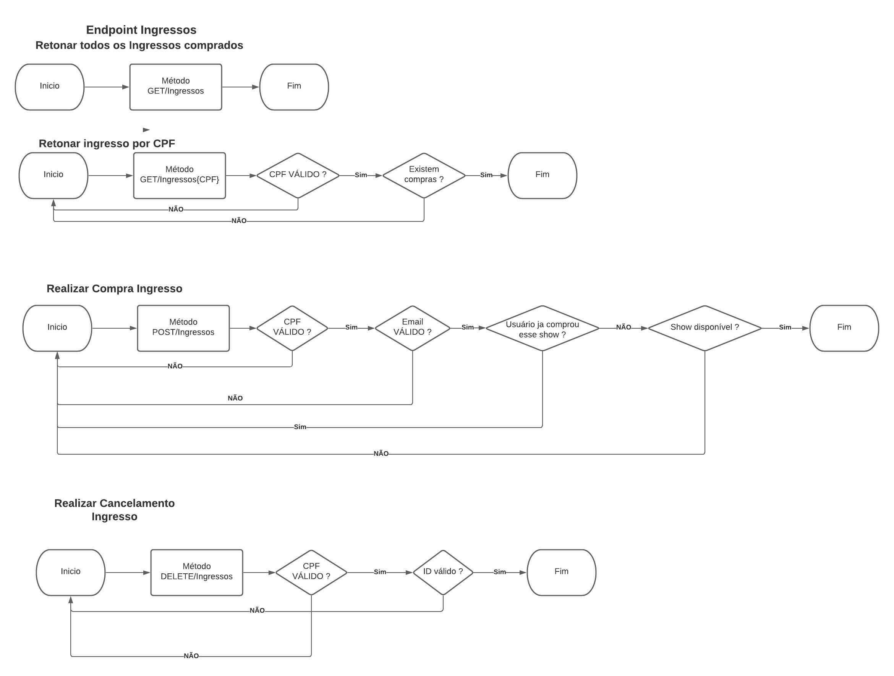
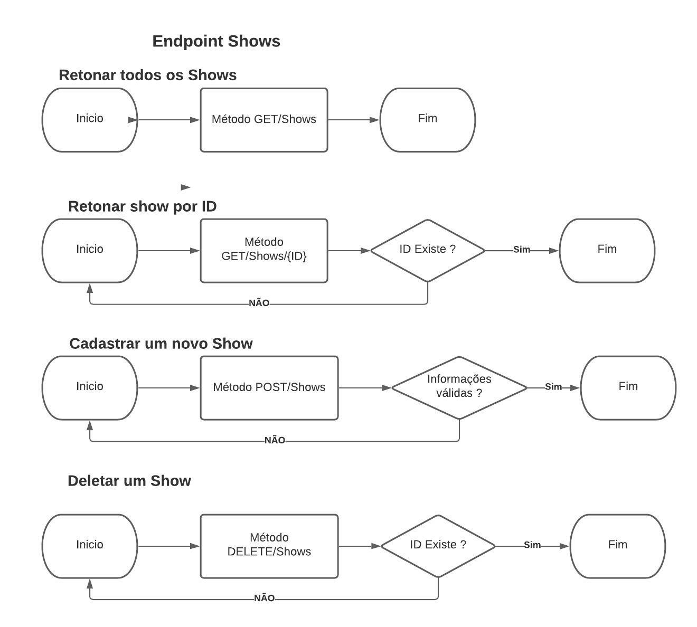
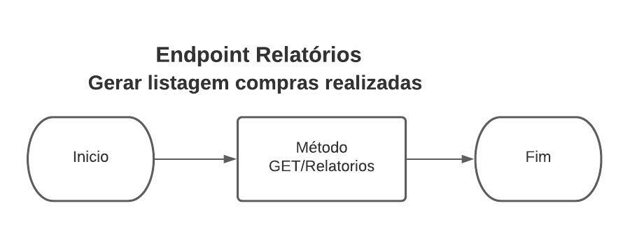

# pagedocs

<header id="header" class="sticky-top">

<nav class="primary-menu navbar navbar-expand-lg navbar-dropdown-dark">

<button id="sidebarCollapse" class="navbar-toggler d-block d-md-none" type="button"></button>

### Docs API Ingressos

v1.0

</nav>

</header>

*   [Sobre](#Sobre)
*   [Endpoints](#Endpoints)
    *   [Ingressos](#Ingressos)
        *   [GET /ingressos](#getingressos)
        *   [GET /ingressos/CPF](#getingressoscpf)
        *   [POST /ingressos](#postingessos)
        *   [DELETE /ingressos/ID](#deleteingressos)
    *   [Shows](#Shows)
        *   [GET /shows](#getshows)
        *   [GET /shows/id](#getshowsid)
        *   [POST /shows](#postshows)
        *   [DELETE /shows/ID](#deleteshows)
    *   [Relatórios](#relatorios)
        *   [GET /relatorios](#getrelatorios)
*   [Tecnologias Utilizadas](#Tecnologias)
*   [Diagrama MER](#diagramamer)
*   [Fluxogramas Macros](#fluxograma)

<section id="Sobre">

# Documentação

## Projeto Ingressos API v1.0

API desenvolvida para que seja possível realizar a compra de ingressos do seu show favorito. Nela o desenvolvedor pode integrar as informações de compras de ingressos e também realizar cadastros de Ingressos e shows diretamente pelo seu sistema. Também consegue exportar uma listagem/relatório de todas as compras realizadas.

* * *

*   **Versão:** 1.0
*   **Autor:** Caique Queiroz
*   **Repositório da documentação:** [Github](https://github.com/CLQueiroz/pagedocs)

*   **Criado:** 15 Julho, 2021
*   **Atualizado:** 15 Julho, 2021

</section>

* * *

<section id="Endpoints">

## Endpoints

Na versão 1.0 da API, é disponibilizado 3 endpoints **Ingressos** - **Shows** - **Relatórios**

</section>

<section id="Ingressos">

## Ingressos

No endpoint de ingresso é possível comprar, cancelar e listar as compras realizadas filtrando por CPF, ou todas as compras realizadas.

#### GET /ingressos

Para visualizar todos os ingressos comprados de todas as pessoas, utilizar o endpoint de **/ingressos** podemos visualizar todos os ingressos comprados selecionando o método **GET /ingressos** será retornado um 200 de sucesso, com a seguinte estrutura:

<pre>              `{
        "id": 1,
        "nome": "Joãosinho",
        "email": "joasinho@hotmail.com",
        "cpf": "11111111111",
        "detalheShowId": 10
      }` 
            </pre>

#### GET /ingressos/{CPF}

Para visualizar todos os ingressos comprados por CPF, utilizar o endpoint de /ingressos podemos visualizar todos os ingressos comprados selecionando o método GET /ingressos/{CPF}. Ao informar o CPF será retornado todos os ingressos comprados pelo mesmo será retornado um 200 de sucesso, com a seguinte estrutura:

*   Informar o CPF no parametro da rota GET /ingressos/11111111111

<pre>         `{
          "id": 1,
          "nome": "Joãosinho",
          "email": "joasinho@hotmail.com",
          "cpf": "11111111111",
          "detalheShowId": 10
        }` 
         </pre>

#### POST /ingressos

Para Realizar a compra, utilizar o endpoint de /ingressos. No método POST /ingressos enviar as informações básicas do comprador e informar o DetalheShowId que contem as informações do show desejado para compra. Será realizado as seguintes validações.

*   CPF Comprador precisa ser válido.
*   Email do Comprador precisa ser válido
*   DetalheShowId do show precisa existir na base de dados.
*   Após a compra será atualizado a capacidade do DetalheShow comprado.
*   Não é permitido a compra do mesmo ingresso por CPF.
*   Não é permitido a compra de um ingresso com capacidade esgotada.

Exemplo de Request:

<pre>          `{
            "nome": "Joãosinho",
            "email": "joasinho@hotmail.com",
            "cpf": "11111111111",
            "detalheShowId": 10
          }` 
          </pre>

Após validações será retornado um 200 com o ingresso comprado com a seguinte estrutura:

<pre>                      `{
            "id": 1,
            "nome": "Joãosinho",
            "email": "joasinho@hotmail.com",
            "cpf": "11111111111",
            "detalheShowId": 10
          }` 
          </pre>

#### DELETE /ingressos/{ID}

Para Realizar o cancelamento da compra, utilizar o endpoint de /ingressos. No método DELETE /ingressos/{ID} informar o ID e o CPF do comprador do show que deseja cancelar.

*   caso não exista o ingresso será retornado um STATUS 404.
*   caso de tudo OK será retornado um STATUS 200.

</section>

* * *

<section id="Shows">

## Shows

No endpoint de shows é possível cadastrar, excluir, atualizar e listar os shows cadastrados.

#### GET /Shows

Para visualizar todos os shows disponíveis utilizar o endpoint de /Shows podemos visualizar todos os shows disponíveis para compra no método GET /shows será retornado um Status 200 com todos os shows cadastrados(Ja existe cadastrado uma lista com 10 shows disponíveis). Assim como o exemplo a seguir:

<pre>            `{
              "id": 1,
              "titulo": "AC/DC",
              "data": "2021-12-29T00:00:00",
              "detalheShows": {
                "id": 1,
                "tipoIngressoId": 1,
                "capacidade": 10,
                "valor": 1000,
                "showDisponivel": "Sim"
              }
            }` 
            </pre>

#### GET /Shows/{ID}

Para visualizar um show específico utilizar o endpoint de /shows. ao selecionar o método GET /Shows/{ID} será retornado Status 200 com o show. Assim como o exemplo a seguir:

*   GET /shows/1

<pre>            `{
              "id": 1,
              "titulo": "AC/DC",
              "data": "2021-12-29T00:00:00",
              "detalheShows": {
                "id": 1,
                "tipoIngressoId": 1,
                "capacidade": 10,
                "valor": 1000,
                "showDisponivel": "Sim"
              }
            }` 
            </pre>

#### POST /Shows

Para cadastrar um novo show, utilizar o endpoint de /shows. No método POST /shows/{ID} informar as propriedades obrigatórias, caso ok, será retornado um Status 200 com o show criado. As seguintes propriedades são obrigatórias para a criação do mesmo.

*   Titulo Precisa ser uma string.
*   Data Tipo do campo Datetime utilizar como exemplo '2021-12-25'.
*   DetalheShowId do show precisa existir na base de dados.
*   DetalheShow No Objeto DetalheShow é para detalhar as informações principais do ingresso, Capacidade, valor e o tipoIngressoId que cada ingresso pode conter até 3 tipos de ingresso sendo eles VIP - CAMAROTE - PISTA

Exemplo para criar um novo shows:

<pre>            `{
            "titulo": "Linkin Park",
            "data": "2021-11-22",
            "detalheShows":
            {
              "capacidade": 50,
              "valor": 3000.00,
              "tipoingressoId": 1
            }
          }` 
            </pre>

Após validações será retornado um 200 com o show cadastrado com a seguinte estrutura:

<pre>            `{
              "id": 1,
              "titulo": "Bee gees",
              "data": "2021-12-23",
              "detalheShows": {
                "id": 1,
                "tipoIngressoId": 1,
                "capacidade": 100,
                "valor": 250.00,
                "showDisponivel": "Sim"
               }
            }` 
                      </pre>

#### DELETE /Shows/{ID}

Para excluir o show, utilizar o endpoint de /shows. No método DELETE /shows/{ID} informar o ID do show que deseja cancelar, caso ok, será retornado um Status 200 confirmando a exclusão.

*   caso não exista o ingresso será retornado um STATUS 404.
*   caso de tudo OK será retornado um STATUS 200.

</section>

* * *

<section id="relatorios">

## Relatórios

No Endpoint de relatórios, será utilizado apenas o método GET /Relatorios e será retornado uma listagem de todas as compras realizadas em planilha.

#### GET /Relatorios

Será retornado um status 200 ok caso de certo, e a o caminho onde a planilha foi salva.

<pre>              `Arquivo gerado com sucesso em C:\Users\caiqu\Documents\Treinamentos Desenvolvimento
          Active\Testes\ProjetoIngressosAPI\ProjetoIngressosAPI\bin\Debug\netcoreapp3.1\\ListagemPessoasporShow.xlsx` 
            </pre>

* * *

<section id="Tecnologias">

## Tecnologias Utilizadas

*   Asp.Net Core API WEB 3.1
*   Banco de dados em SQLite
*   Entity Framework Core 3.1

</section>

* * *

<section id="diagramamer">

## Diagrama do banco de dados

</section>

<section id="fluxograma">

## Fluxogramas Macro

#### Processo Macro Ingressos

#### Processo Macro Shows

#### Processo Macro Relatórios

</section>

</section>

